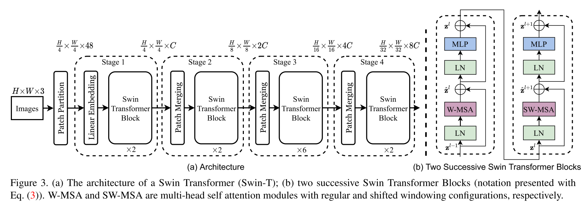

## Swin Transformer - PyTorch



### Install

```bash
$ pip install swin-transformer-pytorch
```

or (if you clone the repository)

```bash
$ pip install -r requirements.txt
```

### Usage

```python
import torch
from swin_transformer_pytorch import SwinTransformer

net = SwinTransformer(
    hidden_dim=96,
    layers=(2, 2, 6, 2),
    heads=(3, 6, 12, 24),
    channels=3,
    num_classes=3,
    head_dim=32,
    window_size=7,
    downscaling_factors=(4, 2, 2, 2),
    relative_pos_embedding=True
)
dummy_x = torch.randn(1, 3, 224, 224)
logits = net(dummy_x)  # (1,3)
print(net)
print(logits)
```
### Parameters
- `hidden_dim`: int.  
What hidden dimension you want to use for the architecture, noted C in the original paper
- `layers`: 4-tuple of ints divisible by 2.  
How many layers in each stage to apply. Every int should be divisible by two because we are always applying a regular and a shifted SwinBlock together.
- `heads`: 4-tuple of ints   
How many heads in each stage to apply.
- `channels`: int.  
Number of channels of the input.    
- `num_classes`: int.  
Num classes the output should have.    
- `head_dim`: int.  
What dimension each head should have.    
- `window_size`: int.  
What window size to use, make sure that after each downscaling the image dimensions are still divisible by the window size.    
- `downscaling_factors`: 4-tuple of ints.  
What downscaling factor to use in each stage. Make sure image dimension is large enough for downscaling factors.    
- `relative_pos_embedding`: bool.  
Whether to use learnable relative position embedding (2M-1)x(2M-1) or full positional embeddings (M²xM²).

